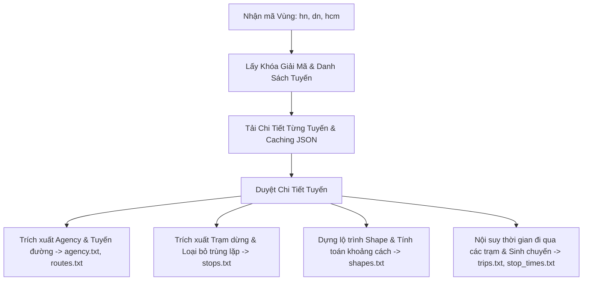

# BusMap Crawler & GTFS Builder

Dự án này cung cấp bộ công cụ tự động gọi API của ứng dụng **BusMap**, giải mã dữ liệu hành trình xe buýt (AES-256-CBC) và biên dịch chúng thành định dạng dữ liệu giao thông công cộng chuẩn quốc tế **GTFS (General Transit Feed Specification)** cho các khu vực như Hà Nội, Đà Nẵng và Thành phố Hồ Chí Minh.

---

## 📌 Câu hỏi chính: Tệp `build_all_gtfs.py` đã bao gồm đầy đủ quy trình chưa?

**Có, tệp [build_all_gtfs.py](file:///c:/Users/TANDAITHANH.COM.VN/Downloads/map.busmap.vn/script/build_all_gtfs.py) đã tích hợp đầy đủ quy trình khép kín** (All-in-One) bao gồm:
1. Tự động lấy khóa giải mã API động từ máy chủ BusMap.
2. Tải danh sách tất cả các tuyến của khu vực chỉ định (`hn`, `dn`, `hcm`...).
3. Tải và lưu tệp chi tiết (danh sách trạm, tọa độ địa lý, lịch trình xuất bến) của từng tuyến dưới dạng JSON, hỗ trợ **cơ chế cache** để tránh tải lại những tuyến đã có sẵn.
4. Biên dịch dữ liệu thô thành **8 tệp tiêu chuẩn GTFS**: `agency.txt`, `routes.txt`, `stops.txt`, `shapes.txt`, `trips.txt`, `stop_times.txt`, `calendar.txt`, `feed_info.txt`.
5. Hỗ trợ **cơ chế cập nhật gia tăng (incremental update)**: Khi dựng GTFS cho một khu vực mới, dữ liệu cũ của các khu vực khác trong tệp GTFS dùng chung sẽ được bảo toàn, chỉ ghi đè dữ liệu của khu vực đang xử lý.

---

## 📂 Cách cấu trúc và tạo thư mục `output`

Thư mục `output` chứa kết quả của quá trình cào và biên dịch dữ liệu. Bạn **không cần phải tạo thủ công** thư mục này, mã nguồn trong các script đã tự động xử lý việc kiểm tra và tạo cấu trúc thư mục bằng thư viện `pathlib` của Python (`Path.mkdir(parents=True, exist_ok=True)`). 

Cấu trúc thư mục `output` sau khi chạy script sẽ như sau:
```text
map.busmap.vn/
└── output/
    ├── region/
    │   └── list.json                # Danh sách tất cả các tỉnh thành/khu vực hỗ trợ
    ├── route/
    │   ├── list/
    │   │   ├── hn.json              # Danh sách tuyến của Hà Nội
    │   │   ├── dn.json              # Danh sách tuyến của Đà Nẵng
    │   │   └── hcm.json             # Danh sách tuyến của TP. HCM
    │   └── detail/
    │       ├── hn/                  # Chi tiết từng tuyến của Hà Nội (tọa độ, trạm, lịch trình)
    │       ├── dn/                  # Chi tiết từng tuyến của Đà Nẵng
    │       └── hcm/                 # Chi tiết từng tuyến của TP. HCM
    └── gtfs/                        # Thư mục chứa các tệp GTFS chuẩn dùng chung
        ├── agency.txt
        ├── calendar.txt
        ├── feed_info.txt
        ├── routes.txt
        ├── shapes.txt
        ├── stop_times.txt
        ├── stops.txt
        └── trips.txt
```

---

## ⚙️ Quy trình xây dựng dữ liệu GTFS

Quá trình xây dựng GTFS từ dữ liệu JSON được thực hiện qua các bước chính:



---

## 📐 Các công thức toán học sử dụng

### 1. Khoảng cách địa lý mặt cầu (Công thức Haversine)
Dùng để tính khoảng cách giữa hai tọa độ địa lý (kinh độ, vĩ độ) theo đơn vị mét trên bề mặt Trái Đất. Công thức này đóng vai trò quan trọng trong việc tính toán chiều dài tuyến đường và khoảng cách đã di chuyển (`shape_dist_traveled`):
$$d = 2R \times \arcsin\left(\sqrt{\sin^2\left(\frac{\Delta \phi}{2}\right) + \cos(\phi_1)\cos(\phi_2)\sin^2\left(\frac{\Delta \lambda}{2}\right)}\right)$$
*Trong đó:*
* $R = 6.371.000$ mét (Bán kính trung bình của Trái Đất).
* $\phi_1, \phi_2$ là vĩ độ của điểm thứ nhất và thứ hai (đơn vị radian).
* $\Delta \phi, \Delta \lambda$ lần lượt là độ chênh lệch vĩ độ và kinh độ.

### 2. Khoảng cách từ điểm đến đoạn thẳng (Point-to-Segment Distance)
Do dữ liệu API của BusMap phân tách danh sách tọa độ chi tiết đường đi (`pathPoints`) và danh sách tọa độ của trạm dừng (`stations`), dự án sử dụng phép chiếu vectơ phẳng cục bộ để xác định vị trí chính xác của trạm dừng trên đường đi:
1. Đổi tọa độ địa lý $P(lon, lat)$ của trạm dừng và đoạn thẳng $AB$ nối 2 điểm liên tiếp trên lộ trình về mặt phẳng tọa độ mét cục bộ (sử dụng hệ số tỷ lệ vĩ độ $\cos(lat) \times 111.132$).
2. Tìm điểm chiếu $H$ của trạm $P$ lên đoạn $AB$:
   $$t = \max\left(0, \min\left(1, \frac{\vec{AP} \cdot \vec{AB}}{|\vec{AB}|^2}\right)\right)$$
   $$H = A + t \times \vec{AB}$$
3. Khoảng cách giữa trạm dừng và đường lộ trình là độ dài $|\vec{PH}|$. Khoảng cách tích lũy tính từ đầu tuyến đến trạm dừng bằng tổng khoảng cách của các đoạn trước đó cộng với độ dài đoạn $AH$.

### 3. Nội suy thời gian di chuyển (Time Interpolation)
Thời gian xe đi qua trạm dừng được ước lượng dựa trên khoảng cách tích lũy dọc theo tuyến đường (`shape_dist_traveled`) chia cho vận tốc trung bình giả định của xe buýt ($V \approx 15 \text{ km/h} \approx 4.17 \text{ m/s}$):
$$\text{Offset Seconds} = \frac{\text{Distance Traveled (m)}}{V \text{ (m/s)}}$$
Thời gian đến trạm = Giờ xuất bến + $\text{Offset Seconds}$.

---

## 🛡️ Biện pháp tránh lỗi dữ liệu khi xây dựng GTFS

Trong thực tế, dữ liệu gốc từ API thường chứa nhiều lỗi hình học hoặc thiếu sót. Các biện pháp tránh lỗi sau đã được tích hợp trong script:

* **Tránh lỗi khoảng cách giảm hoặc bằng nhau (`Decreasing or equal shape_dist_traveled`):** 
  GTFS yêu cầu khoảng cách tích lũy dọc theo tuyến đường (`shape_dist_traveled`) của các điểm trên shape hoặc stop_times phải tăng đơn điệu. Nếu khoảng cách trạm sau nhỏ hơn hoặc bằng trạm trước (do sai số GPS hoặc trạm đặt quá gần nhau), hệ thống tự động cộng thêm khoảng cách trực tiếp tối thiểu giữa 2 trạm hoặc bù một khoảng cách nhỏ (`+0.1m` hoặc `+0.01m`) để đảm bảo tính tăng dần.
* **Khắc phục lỗi khoảng cách địa lý trạm quá xa lộ trình (`geoDistanceToShape`):**
  Nếu một trạm dừng nằm lệch khỏi đường đi của shape quá xa ($> 10$ mét), bộ giải thuật sẽ tự động chèn thêm một điểm tọa độ trùng với trạm đó vào đường đi của shape để kéo lộ trình bám sát vào trạm, tránh việc các bộ kiểm định (validators) báo lỗi.
* **Loại bỏ tọa độ lỗi (Tọa độ 0,0):**
  Tất cả các trạm dừng có kinh vĩ độ bị lỗi bằng `0.0` sẽ tự động bị bỏ qua để tránh làm méo mó bản đồ và phá vỡ cấu trúc địa lý của tuyến.
* **Tránh bị khóa IP khi cào dữ liệu (Rate Limit & Connection Timeout):**
  Giữa mỗi lượt gọi API tải chi tiết tuyến, script được thiết lập nghỉ `0.5` giây (`time.sleep(0.5)`) để tránh tạo lượng truy cập dồn dập khiến server BusMap chặn IP. Tệp tin cũng sử dụng cơ chế kiểm tra sự tồn tại của tệp chi tiết cục bộ (cache) để không tải lại dữ liệu đã có.

---

## 🚀 Hướng dẫn sử dụng chi tiết

### 1. Cài đặt môi trường
Đảm bảo máy tính của bạn đã cài đặt Python 3 và các thư viện hỗ trợ bằng lệnh sau:
```bash
pip install requests cryptography
```
*(Hoặc dùng thư viện thay thế nếu cần: `pip install pycryptodome`)*

### 2. Chạy quy trình biên dịch GTFS (Khuyên dùng)
Để thực hiện toàn bộ quy trình cào dữ liệu và xây dựng tệp GTFS tự động cho một khu vực, hãy chạy tệp [build_all_gtfs.py](file:///c:/Users/TANDAITHANH.COM.VN/Downloads/map.busmap.vn/script/build_all_gtfs.py) kèm tham số `--region`:

* **Xây dựng GTFS cho Hà Nội:**
  ```bash
  python script/build_all_gtfs.py --region hn
  ```
* **Xây dựng GTFS cho Đà Nẵng:**
  ```bash
  python script/build_all_gtfs.py --region dn
  ```
* **Xây dựng GTFS cho TP. Hồ Chí Minh:**
  ```bash
  python script/build_all_gtfs.py --region hcm
  ```

---

## 🛠️ Danh sách và vai trò của các tệp Script khác

Nếu không muốn chạy công cụ All-in-One, bạn có thể thực thi độc lập các kịch bản phụ trợ trong thư mục [script/](file:///c:/Users/TANDAITHANH.COM.VN/Downloads/map.busmap.vn/script):

1. **[fetch_hanoi_routes.py](file:///c:/Users/TANDAITHANH.COM.VN/Downloads/map.busmap.vn/script/fetch_hanoi_routes.py)**: Module chứa nhân giải mã AES-256-CBC và các hàm gọi API cốt lõi. Chạy trực tiếp sẽ tải mẫu tuyến 01 và 02 của Hà Nội để thử nghiệm.
2. **[fetch_all_hn_routes.py](file:///c:/Users/TANDAITHANH.COM.VN/Downloads/map.busmap.vn/script/fetch_all_hn_routes.py)**: Chỉ thực hiện tải danh sách tuyến của riêng Hà Nội lưu về dạng JSON.
3. **[fetch_all_hn_route_details.py](file:///c:/Users/TANDAITHANH.COM.VN/Downloads/map.busmap.vn/script/fetch_all_hn_route_details.py)**: Đọc danh sách tuyến Hà Nội và tải chi tiết về thư mục cache.
4. **[crawl_all_routes.py](file:///c:/Users/TANDAITHANH.COM.VN/Downloads/map.busmap.vn/script/crawl_all_routes.py)**: Thực hiện cào dữ liệu thô bao gồm cả lịch trình timeline chi tiết của Hà Nội và lưu vào thư mục `output/raw/`.
5. **[build_gtfs.py](file:///c:/Users/TANDAITHANH.COM.VN/Downloads/map.busmap.vn/script/build_gtfs.py)**: Đọc dữ liệu thô từ thư mục `output/raw/` để dựng các tệp GTFS của Hà Nội.
6. **[build_stops.py](file:///c:/Users/TANDAITHANH.COM.VN/Downloads/map.busmap.vn/script/build_stops.py)**, **[build_routes.py](file:///c:/Users/TANDAITHANH.COM.VN/Downloads/map.busmap.vn/script/build_routes.py)**, **[build_agency.py](file:///c:/Users/TANDAITHANH.COM.VN/Downloads/map.busmap.vn/script/build_agency.py)**: Các script đơn nhiệm dùng để biên dịch đơn lẻ các bảng `stops.txt`, `routes.txt`, và `agency.txt` tương ứng từ thư mục chi tiết.
